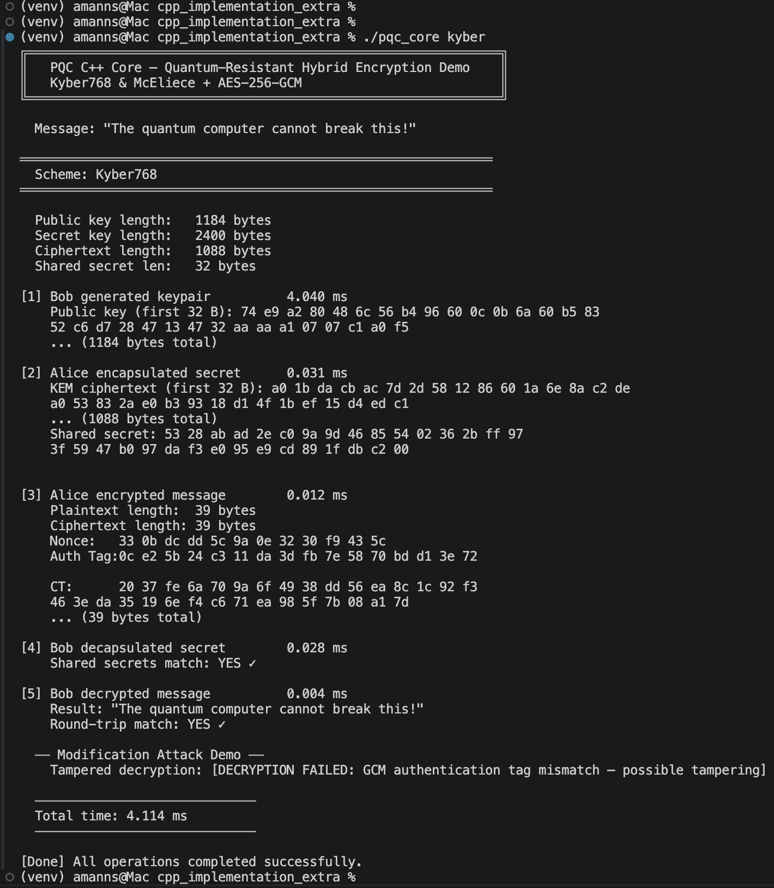
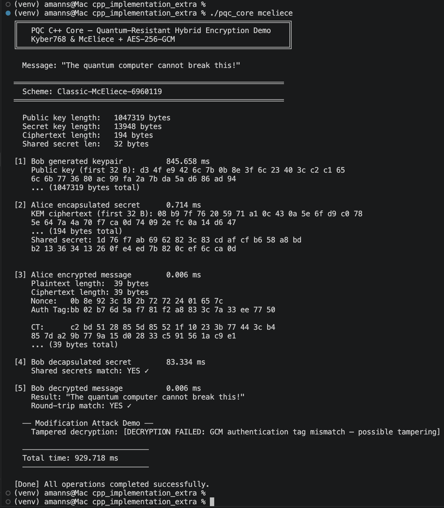

# PQCSecureChat

Quantum-resistant two-party secure communication.  

---

## Demo Video

Full walkthrough of architecture, live secure chat, attack simulations, and performance benchmarks:  
[▶️ Watch Demo](YOUR_VIDEO_LINK_HERE)

## Project Requirements Coverage

| Requirement | How it's met |
|---|---|
| Two PQC schemes (one lattice, one code-based) | **Kyber768** (MLWE lattice) + **Classic McEliece-6960119** (code-based) |
| Data confidentiality | AES-256-GCM with HKDF-SHA256 derived key |
| Integrity attack detection | GCM authentication tag — any tampered bit fails decryption |
| Replay attack detection | Timestamp AAD + nonce tracking in SecureChannel |
| Key length comparison | See dashboard `/api/benchmark/full` — PK: 1.18 KB vs ~1 MB |
| Performance comparison | Chat UI metrics strip + dashboard charts |
| C++ extra credit | `cpp_implementation_extra/pqc_core.cpp` — identical protocol in C++ |

---

## Architecture

```
app.py                  Flask API backend (real KEM + AES-256-GCM)
chat_ui.html            Chat frontend  → calls API endpoints
dashboard.html          Benchmark dashboard → /api/benchmark/full
secure_channel.py       AES-256-GCM channel (pycryptodome)
base_protocol.py        KEM protocol base class (requires liboqs)
utils.py                Print helpers
cpp_implementation_extra/
  pqc_core.cpp          C++ implementation (extra credit)
  Makefile              Auto-detects macOS / Linux
  README.md             C++ build instructions
  test_results_screenshots/
    kyber_cpp.png       Execution results for Kyber
    mceliece_cpp.png    Execution results for McEliece
```

---

## Quick Start

```bash
# 1. Install Python deps
pip install flask cryptography pycryptodome

# 2. Install real PQC (Kyber768 / McEliece):
# macOS (Homebrew):
brew install liboqs
pip install liboqs-python

# Ubuntu/Debian:
sudo apt install liboqs-dev
pip install liboqs-python

# 3. Start backend (default port 5001 — macOS reserves 5000 for AirPlay)
python app.py

# Optional: run on a different port
python app.py --port 5000

# 4. Open frontends in browser
open chat_ui.html
open dashboard.html
```

> **Note on port 5001**: macOS Monterey and later reserve port 5000 for AirPlay Receiver,
> so the backend defaults to **5001**. Both HTML files are pre-configured for `localhost:5001`.
> To use port 5000, run `python app.py --port 5000` and update `API_BASE` in both HTML files.

---

## API Endpoints

| Endpoint | Method | Description |
|---|---|---|
| `/api/status` | GET | Health check + liboqs availability |
| `/api/keygen` | POST | Generate KEM keypair -> session_id + public_key |
| `/api/encapsulate` | POST | Sender encapsulates shared secret |
| `/api/decapsulate` | POST | Receiver decapsulates shared secret |
| `/api/encrypt` | POST | AES-256-GCM encrypt a message |
| `/api/decrypt` | POST | AES-256-GCM decrypt + verify |
| `/api/full_exchange` | POST | Complete KEX + encrypt + decrypt in one call |
| `/api/benchmark` | POST | Benchmark a single scheme |
| `/api/benchmark/full` | POST | Benchmark both schemes (dashboard) |

---

## Crypto Stack

- **KEM**: Kyber768 / Classic-McEliece-6960119 via liboqs (fallback: X25519 ECDH when liboqs absent)
- **Symmetric**: AES-256-GCM (authenticated encryption — confidentiality + integrity)
- **KDF**: HKDF-SHA256 (shared secret -> 256-bit AES key)
- **Replay protection**: 64-bit timestamp as GCM AAD + nonce tracking (60s window)

### Attack Coverage

| Attack | Defense |
|---|---|
| Eavesdropping | KEM + AES-256-GCM: ciphertext reveals nothing without the private key |
| Data modification | GCM auth tag: any 1-bit change causes authentication failure |
| Replay | Timestamp AAD validated against 60s window; nonce reuse detected |

---

## C++ Extra Credit

```bash
cd cpp_implementation_extra

# macOS
brew install liboqs openssl@3
make

# Ubuntu
sudo apt install liboqs-dev libssl-dev build-essential
make

# Run
./pqc_core kyber    "Transfer $1000 to Account #12345"
./pqc_core mceliece "Transfer $1000 to Account #12345"
./pqc_core both     "Transfer $1000 to Account #12345"
```

## Test Results (C++ Implementation)

Screenshots demonstrating successful execution of both PQC schemes in the C++ implementation:

### Kyber768


### Classic McEliece


The C++ implementation uses:
- liboqs C API (OQS_KEM_keypair, OQS_KEM_encaps, OQS_KEM_decaps)
- OpenSSL 3.x EVP API for AES-256-GCM
- OpenSSL EVP_KDF HKDF with identical salt/info to Python — cross-compatible keys
- Modification attack demo: bit-flip triggers GCM authentication failure

---

## Scheme Comparison

| Property | Kyber768 | Classic McEliece-6960119 |
|---|---|---|
| Family | Lattice (MLWE) | Code-based |
| NIST Level | 3 (approx AES-192) | 5 (approx AES-256) |
| Public Key | 1,184 bytes | ~1.04 MB |
| Secret Key | 2,400 bytes | 13,948 bytes |
| Ciphertext | 1,088 bytes | 194 bytes |
| Keygen | ~0.1 ms | ~1,000-5,000 ms |
| Encap | ~0.1 ms | ~0.5 ms |
| Decap | ~0.1 ms | ~0.5 ms |
